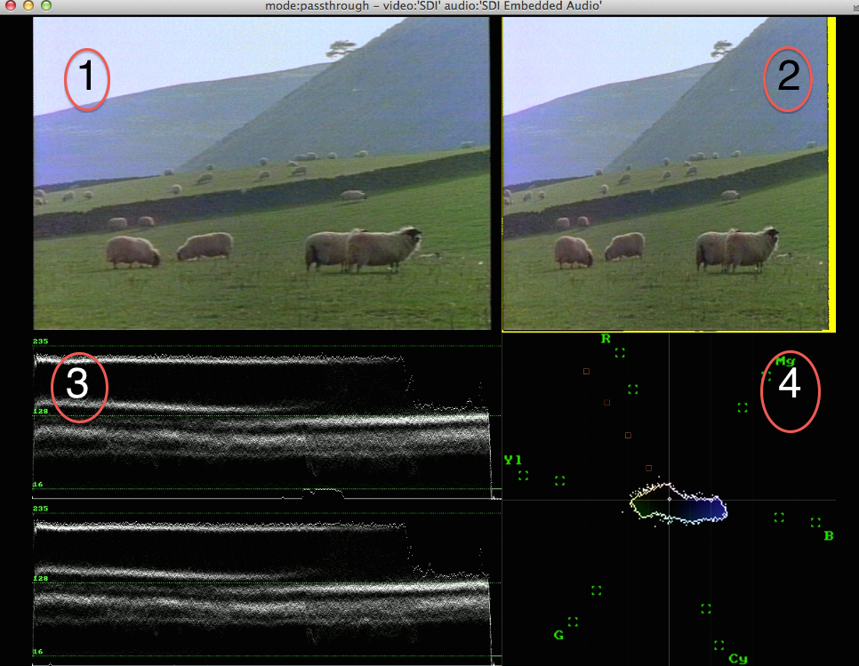
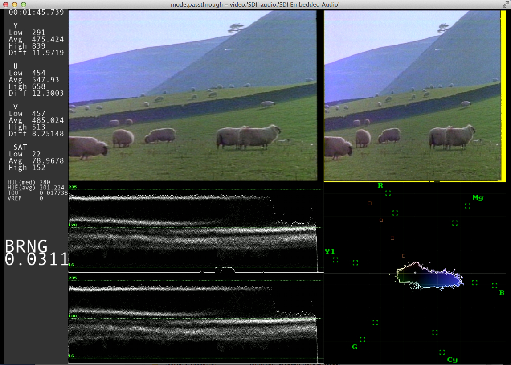
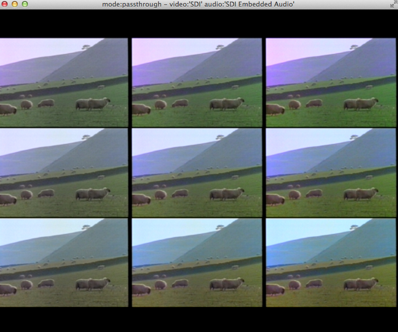
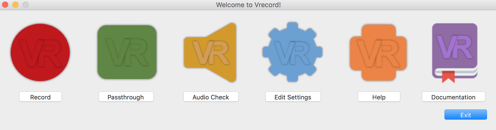

# Vrecord Documentation

This documentation is up to date as of vrecord version 2017-06-15.

## Table of Contents

1. [Summary](#summary)
1. [Installing vrecord](#installing-vrecord)
1. [Using vrecord](#using-vrecord)
   1. [Setting up vrecord for the First Time](#setting-up-vrecord-for-the-first-time)
   1. [Basic Usage](#basic-usage)
   1. [The vrecord Window](#the-vrecord-window)
   1. [Passthrough Mode](#passthrough-mode)
   1. [Audio Passthrough Mode](#audio-passthrough-mode)
   1. [Edit Mode](#edit-mode)
      1. [Options for Video Capture](#options-for-video-capture)
      1. [A Few Quirks](#a-few-quirks)
         1. [Timing of Recording](#timing-of-recording)
         1. [FFmpeg Error Message](#ffmpeg-error-message)
   1. [Ending a capture](#ending-a-capture)
   1. [Clearing the Configuration File](#clearing-the-configuration-file)
1. [Help and Issues](#help-and-issues)
1. [License](#license)

---

## Summary

Vrecord is open-source software for capturing a video signal and turning it into a digital file. Its purpose is to make videotape digitization or transfer easier. Vrecord can capture analog and digital signals through a variety of inputs and can create digital video files in a variety of formats and codecs. Vrecord has been designed with needs of audiovisual archivists in mind. 

Vrecord uses [ffmpeg](http://ffmpeg.org), [ffplay](http://ffmpeg.org/ffplay.html), and [bmdcapture](https://github.com/lu-zero/bmdtools) to do its dirty work.

Currently vrecord only supports Blackmagic Design capture cards with the Blackmagic driver installed. 

## Installing vrecord

If you use macOS, you can easily install vrecord using a package manager called Homebrew. To install Homebrew, follow the instructions here: http://brew.sh/

To install vrecord, run the following commands:

`brew tap amiaopensource/amiaos` (taps the homebrew recipes of the amiaopensource account)

`brew install vrecord` (installs vrecord and the other programs that it requires)

Once vrecord has been successfully installed, you can update it to the latest release by first running:

`brew update` (updates all of your Homebrew recipes to the latest versions)

Then running:

`brew upgrade vrecord` (downloads the latest release of vrecord and the latest releases of any other packages it depends on)

Alternatively you can run:

`brew upgrade` (this command will upgrade all of the programs you've installed through Homebrew)

Thus far installing vrecord on Linux has not been successful.

## Using vrecord

### Setting up vrecord for the First Time

In macOS, open System Preferences and click on the icon for Blackmagic Design. If you do not see this icon in System Preferences you may not have installed the Blackmagic driver. 

Open up the Blackmagic Design preferences and click on the "Settings" tab. Select your input and output from the dropdown menu depending on what cables you have connected to the capture device. 

Once your capture device is set up you can start vrecord by simply opening up a [Terminal window](https://en.wikipedia.org/wiki/Terminal_%28OS_X%29) and typing 
```
vrecord 
```
The first time you use vrecord you will be asked to make some initial choices about how you want to capture. Any decisions you make will be saved in a cofiguration file. But don't worry, you will be able to alter these decisions later. 
Vrecord will ask you for video and audio inputs. These should agree with your settings for the Blackmagic capture device. Vrecord's other settings can be tailored to your liking. See the section on [Options for Video Capture](https://github.com/amiaopensource/vrecord#options-for-video-capture) below which explains all of the settings in detail.

### Basic Usage

For those who want the simplest possible explanation on how to use vrecord:

1. Run `vrecord -p`.
1. Choose the appropriate options when prompted.
1. Play your tape in the connected VTR and set up to color bars and audio on the tape (if possible).
1. Close the vrecord window to end passthrough mode.
1. Now run `vrecord -e` and make sure all options are correct in vrecord's GUI window.
1. Type in a unique identifier for your video file when prompted.
1. Press "enter" to start recording.
1. Let 'er rip! Play your tape!
1. Let vrecord do its thing. Don't type any keys while the vrecord window is open, do not click the mouse inside the vrecord window, and do not start another instance of vrecord on the same computer. In fact it's best not to open or use any other programs on the computer that is capturing. Overtaxing the computer could cause errors in the capture. 
1. If you are finished recording and the vrecord window hasn't already closed, close the window.
1. Check the Terminal window for any error messages. Hopefully you don't see any cows.  
1. Check to make sure that your video and metadata files were successfully created. 
1. Repeat steps 1–12 as needed.

### The vrecord Window



Shown above is the layout of the vrecord window in "Broadcast Range Visual" mode. Vrecord also includes a "Visual + Numerical" mode, which is discussed in the [Options for Video Capture](https://github.com/amiaopensource/vrecord#options-for-video-capture) section below.

1. **Video feed** — Displays the entire 720 x 486 video signal coming through. The image will appear a bit more stretched than it does on a television monitor. 
2. **Video feed with broadcast-safe indicator** — Displays a feed of an underscanned version of the video signal. Pixels whose luminance or chrominance is outside of broadcast range are colored yellow. Due to space constraints in the vrecord window this feed will appear slightly squeezed.  
3. **Waveform monitor** — Displays luminance values for each field of the signal separately. The bottom of the red bar in each window represents the upper limit for a broadcast safe white level. The top of the blue bar represents the broacast safe limit for a black level. 
4. **Vectorscope** — Displays chrominance values for the signal. The boxes represent the values for yellow, red, magenta, blue, cyan, and green. The boxes furthest from the center represent the broadcast limits for those colors. 

### Passthrough Mode

Passthrough mode means that the vrecord window will appear with video feeds and scopes, but the incoming video signal will not be recorded to a file. Passthrough mode is best used for tasks like testing equipment or setting up a tape to bars before actually recording. When you are finished using passthrough mode simply close the vrecord window.

Run passthrough mode by typing:
```
vrecord -p
```
If you haven't already set up vrecord it will prompt you to make some selections related to your audio and video inputs. Otherwise the vrecord window will open up and start displaying any video signal coming through from the capture device. 

### Audio Passthrough Mode

Audio Passthrough mode is the same as Passthrough Mode with the addition of audio bars to monitor levels. It can be used to check audio track layout and confirm input levels before starting a transfer. Currently Audio Passthrough Mode does not support the Visual + Numerical view option.

Run audio passthrough mode by typing:
```
vrecord -a
```

### Edit Mode

Running vrecord in edit mode opens a GUI window that allows you to change your recording options and then start digitizing a tape. 

Run edit mode by typing:
```
vrecord -e
```
After selecting all of your options and clicking "OK" the you will be prompted to enter a unique ID for the file. After the ID is entered, the incoming video signal will be recorded to a file with some associated metadata files. When you are done recording, close the vrecord window. If you've set a time limit for capture the vrecord window should automatically close when the time limit has been reached.

By default vrecord will create a video file, a bmdcapture log, a framemd5 file (which creates an MD5 hash value [AKA a checksum] for every frame of video), an ffmpeg log, an ffplay log, and a capture options log (which records the options that you selected in the GUI like codec and video bit depth). Vrecord can also create a [QC Tools](https://github.com/bavc/qctools) XML file, which records the characteristics of the video signal. This file can be imported into QC Tools for further analysis. 

#### Options for Video Capture

All of options in the vrecord GUI (which appears when running `vrecord -e`) or otherwise in text prompts are explained below. If you want to feel like a college freshman you can choose "Undeclared" for any of the options below. You will be prompted later to make a choice before the software actually starts recording:

**Select a recording directory** — Choose the location (on an internal or external hard drive) where you want your resulting video files and logs to be saved.

**Select video input** — Choose how the video signal will be entering the capture device. You can receive the video signal through Composite, SDI, Component, or S-Video cables.

**Select audio input** — Choose how the audio signal will be entering the capture device. You can receive the audio signal through Analog (such as XLR), SDI, or other digital audio cables.  

**Select file format** — Choose the file format that you want the video to be saved in. This is also often called the container.

**Select codec for video** — Choose how you would like the video signal to be encoded digitally. You can choose from some uncompressed, lossless, and lossy codecs. 

**Select bit depth for video** — Choose the level of bit depth you would like for your video file. Vrecord currently supports 8 and 10-bit video capture.

**Select audio channel mapping** — Choose how you want the audio to be captured. Currently vrecord captures audio at 24-bits and can only capture 4 tracks. The options are: 
* "2 Stereo Tracks" — For capturing videotape formats that have four tracks which are arranged as stereo pairs.
* "1 Stereo Track (From Channels 1 & 2)" — For capturing videotape formats that have two channels of audio which were recorded as a stereo pair.
* "1 Stereo Track (From Channels 3 & 4)" — Same as above, but creates stereo track from second pair of inputs.
* "Channel 1 -> 1st Track Mono, Channel 2 -> 2nd Track Mono" — For capturing videotapes with audio recorded on Channel 1 only. Vrecord will capture the audio from Channel 1 and create a mono track. 
* "Channel 2 -> 1st Mono, Channel 1 -> 2nd Track Mono" — For capaturing videotapes with with audio recorded on Channel 2 only. Vrecord will take the audio from Channel 2 and place it in a Channel 1 mono track. 

**Select standard** — Select the television standard of the tape you are digitizing. Currently vrecord only supports NTSC and PAL.

**Broadcast Range Visual mode** — Broadcast Range Visual mode displays the video feed, the video feed with pixels out of broadcast range highlighted, the waveform monitor, and the vectorscope in the vrecord window.

**Full Range Visual mode** - Full Range Visual mode displays the video feed, the video feed with pixels out of full range highlighted, the waveform monitor, and the vectorscope in the vrecord window.

**Visual + Numerical mode** — Visual and Numerical mode displays your favorite video feeds and scopes as well as numerical values for the characteristics of the video signal in the left sidebar. 



The numerical values are as follows:

* Y — Low, high, and average luminance of the video signal. "Diff" means the difference of the luminance between successive frames.
* U — Low, high, and average of the U channel value of the video signal. "Diff" means the difference of the U value between successive frames.
* V — Low, high, and average of the V channel value of the video signal. "Diff" means the difference of the V value between successive frames.
* SAT — Low, high, and average saturation values (sometimes called chroma) of the video signal.
* HUE — Low, high, and average hue values of the video signal.
* TOUT — The percentage of pixels that are temporal outliers. Temporal Outliers are pixels which have different values from the pixels above or below them. This is useful for detecting noise in the video signal or other artifacts. However, the number will also increase with fast motion, camera movement, or cuts to different shots.  
* VREP — The amount of vertical line repititions in the video. The VREP reading can be useful for detecting video artifacts, dropout, and especially head clogs.
* BRNG — Percentage of pixels that are in broadcast range. This may be helpful for detecting problems with the video signal such as dropout or if the signal has not been calibrated properly. If BRNG is 0.1 or greater, you probably have an issue.

**Color Matrix mode** - Color Matrix mode displays the video feed as seen through a matrix with hue and saturation differences to aid in calibrating hue and chroma. If the preferred image is not seen in the center square of the matrix, hue and chroma levels may need to be adjusted.



**Bit Planes mode** — Bit Planes mode allows to display the video according to the bit position of each plane.

**Create QC Tools XML** — While capturing the video signal, vrecord will also create an XML file that contains a record of the characteristics of the video signal (such as luminance, color saturation, audio levels, etc.). It will then compress the XML file using [gzip](https://www.gnu.org/software/gzip/). Choosing to create a QC Tools XML is highly recommended. This file can be quickly imported into QC Tools for further analysis of the video. In addition, if you choose this option, vrecord can analyze the video signal for potential errors. Currently vrecord only tests the saturation levels of the video, but more tests are coming soon!   

**Frame MD5s** — You can choose to create an MD5 hash value (AKA a checksum) for each frame of video captured. A separate .md5 file with all the hash values will be created along with the video file. Generally choosing to create frame-level MD5s will not slow down or hinder the capture of your video. To read more about the value of frame-level MD5s see this article: http://dericed.com/papers/reconsidering-the-checksum-for-audiovisual-preservation/ 

**Set Recording time** — Set the amount of time (in minutes) that you would like vrecord to capture for. This number should be an integer or decimal. For example, if you are digitizing a tape with a capacity of 30 minutes of video, you might want set vrecord to capture for 33 minutes. After 33 minutes vrecord will automatically stop recording and shut down.

**Enter the name of the person digitizing this tape** — This field is optional. You can enter the name of the technician digitizing the tape. The name will be written to the capture options log produced at the end of the transfer.

**Invert Second Channel of Audio** — This option allows you to invert the phase of the second channel of audio on ingest.  This option is only for rare cases. Use only if you are positive that the audio channels are 180 degrees out of phase!

Click "OK" when you are finished with your selections. Vrecord will save all of your selections to a cofiguration file. If any selections are "Undeclared" vrecord will prompt you in the terminal window to make a choice. 

Vrecord will then prompt you for a unique ID. The ID that you type in will become a prefix for the filename of all the resulting files in that recording session. After entering your unique ID you will be asked to press enter to start recording. Press enter and start playing your tape. The vrecord window will appear. Do not type any keys or click the mouse inside the window while the vrecord is working. 

After the transfer is finished, vrecord will automatically check to make sure that no frames were missed during the capture. Check the Terminal window for any error messages. If frames were missed you may get the following message: "WARNING: There were pts discontinuities for these frame ranges: ##-##. The file may have sync issues." The message will give the frame numbers that are missing. Check the file immediately at these points and throughout the video to make sure there are no sync issues. The tape may need to be redigitized.

### GUI Mode

Running vrecord in GUI mode opens a window that allows you to access any of vrecord's other modes (Record, Passthrough, Audio Passthrough, and Edit) via a friendly GUI. 

Run GUI mode by typing:
```
vrecord -g
```
Click the buttons to run Vrecord in your chosen mode. The documentation button brings you to this website!



### Ending a Capture

If you are finished recording and the vrecord window hasn't already closed, close the window.

### A Few Quirks

##### Timing of Recording
When you start recording there may be several seconds of delay before the vrecord window actually appears. But don't worry, once you've pressed enter, vrecord is already capturing the signal and encoding it into a file. 

If you are watching the videotape output on a separate monitor and the video feeds on vrecord appear to be slightly behind the monitor, don't panic; all of your video has still been captured. 

##### FFmpeg Error Message

At the end of your capture you may see a warning in the Terminal that looks similar to this:

```
[v210 @ 0x7fad3c800000] packet too small
Error while decoding stream #0:0: Invalid data found when processing input
[v210 @ 0x7fe62301c000] packet too small
```

You can safely ignore this warning, it's just FFmpeg complaining that it didn't receive a full frame of video when vrecord stopped. 

### Clearing the Configuration File

By default vrecord saves the choices you made the last time you used the program in a configuration file so that these options are selected the next time you use vrecord. If you would like to clear this configuration file and create a new one type:

```
vrecord -x
```
Vrecord will then prompt you to make selections for video capture and proceed to start recording a new tape. If you want to interrupt vrecord hold down control + c. 

## Help and Issues

If you are stuck and want to see vrecord's help menu run:
```
vrecord -h
```
or check the man page:
```
man vrecord
```

If you want to see a more detailed description about how to digitize analog videotape see our document on [analog digitization](Resources/analog_digitization.md).

A short information about the [needed hardware](Resources/hardware.md) is provided as well.

We want vrecord to be a helpful tool for audiovisual archivists and others. If you experience any problems with vrecord you can open a new issue with our Github [issue tracker](https://github.com/amiaopensource/vrecord/issues). Try to see if you can replicate the issue yourself first and describe in detail what factors led to it. Please let us know if you were able to succesfully replicate the issue. 

Feel free to contribute to our github project by creating a fork and sending pull requests.

Enjoy!

The vrecord Team

## License

<a rel="license" href="https://creativecommons.org/licenses/by/4.0/"></a><br>Vrecord is licensed under a <a rel="license" href="https://creativecommons.org/licenses/by/4.0/">Creative Commons Attribution 4.0 International License</a>.
