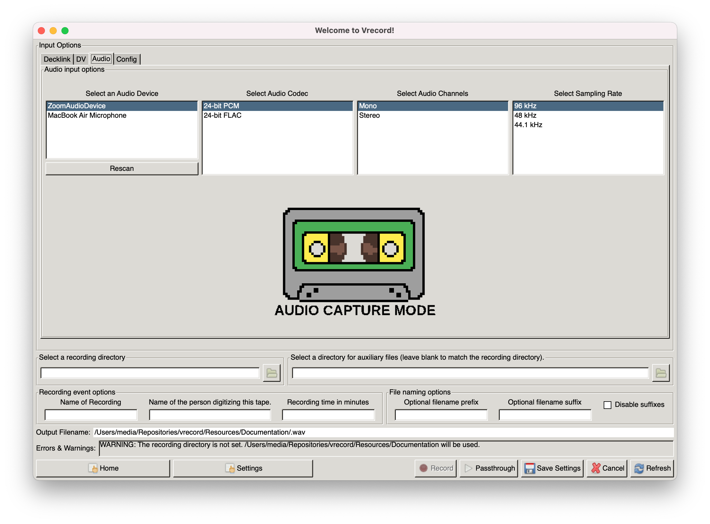

# Audio Capture

## Audio Settings

1. To select the audio input you would like to use, go into the configuration mode either by:
   - run `vrecord -e`
   - clicking on the "Edit Settings" button in the GUI (run `vrecord`)

1. Switch from the "Decklink" tab to the "AUDIO" tab under "Input Options" at the top of the configuration window.

 

1. Select the name of the DV device you want to use from the list.

1. Specify the playback, sidecar, file naming, recording event and directory options as you normally would for vrecord. For details see [Editing Settings](Resources/Documentation/settings.md)

1. Click "OK" to save.