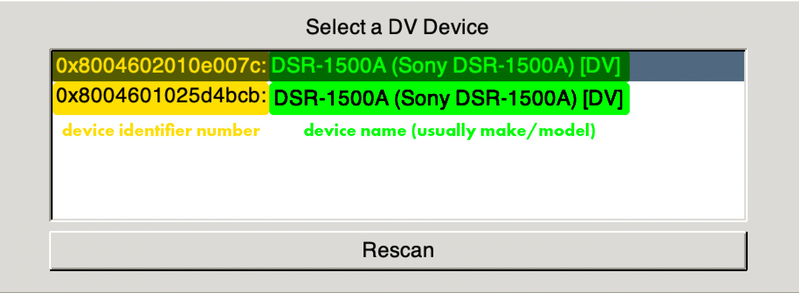
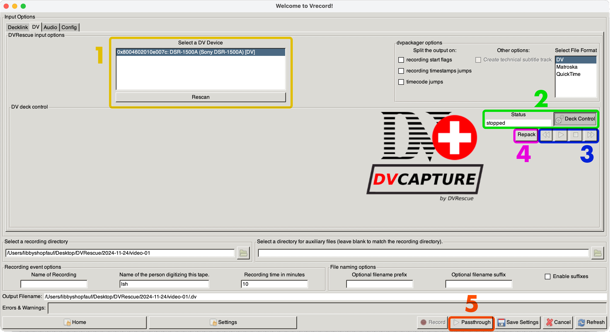
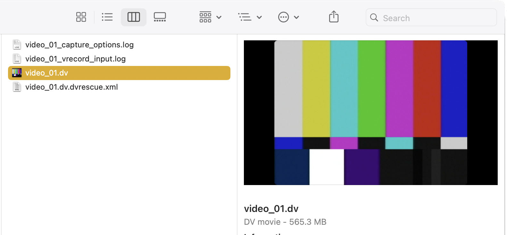
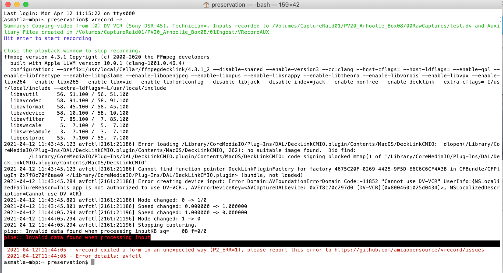

# DV Capture

**macOS:** To capture DV formats (DV, DVCAM, MiniDV, DVCPRO and Digital8) in vrecord, you will need to have your DV deck connected directly to your computer via <a href="https://mipops.github.io/dvrescue/sections/dv_transfer_station.html" target="_blank">FireWire input</a>. Make sure your deck is turned on and in “Remote” mode. Additional settings for your DV device may apply to ensure a successful connection. To view manuals and settings notes for specific decks, players and camcorders, please see the <a href="https://mipops.github.io/dvrescue/sections/deck_guide.html" target="_blank">DVRescue Deck Guide</a>. You may also need to adjust your  <a href="https://mipops.github.io/dvrescue/sections/troubleshooting.html" target="_blank">privacy settings</a> and allow each DV device to connect prior to use with vrecord.

> **_NOTE:_** vrecord uses the <a href="https://github.com/mipops/dvrescue" target="_blank">DVRescue toolkit</a>  to facilitate dvcapture. <a href="https://github.com/mipops/dvrescue/issues/53" target="_blank">HDV tapes</a> are not in the current scope of this project and cannot be captured using DVRescue or vrecord.

## DV Settings

1. Open vrecord's configuration mode via one of the following options:
   - run `vrecord -e` to open the settings menu in the GUI.
   - run `vrecord` and click on the "Edit Settings" button in the GUI.

2. Select the "DV" tab under "Input Options" at the top of the configuration window. All of the devices you have connected via FireWire will be listed under the "DVRescue input options" at the top of the window.

> **_TIP:_** If no devices are listed, click the "Rescan" button below the list. If this doesn't produce any results, make sure your device is connected and turned on. For additional troubleshooting related to device connectivity, please see the <a href="https://mipops.github.io/dvrescue/sections/troubleshooting.html" target="_blank">Troubleshooting</a> page on the DVRescue documentation website.

3. Select the name of the DV device you want to use from the "Select a DV Device" list. The names correspond with the make and model of the connected decks, as well as a unique device identifier. 
> **_TIP:_** If you have two decks of the same make and model connected, you will need to determine the corresponding identifier for each (the number listed before the make and model of each deck). To determine the device identifier numbers for two or more decks of the same make and model:
> - Turn the decks off except one.
> - Check the name of the device still listed in the vrecord GUI.
> - Note the device identifier number displayed.
> - Repeat this for all decks of the same make and model.
> 

4. Specify the playback, sidecar, file naming, recording event and directory options as you normally would for vrecord. For details see [Editing Settings](Resources/Documentation/settings.md).

5. Click "Save Settings" to save.

6. You can then use the passthrough and record modes the same as you would with analog videotape in the "Decklink" tab. Make sure you have a tape inserted before attempting playback or recording. Please see the corresponding sections below for instructions on how to facilitate playback and recording DV tapes.

7. When using the GUI, environment parameters can be adjusted in the Config tab..

## Playback

1. Select the name of the DV device you want to use from the "Select a DV Device" list. If you have two decks of the same make and model connected, please see the "DV Settings" section for steps to determine the device identifier for each one.

2.  Click the "Deck Control" button to allow vrecord to control your device. The status should switch to display "stopped" in the status field (the status will say "disabled" if "Deck Control" is not selected). 

3.  Use the corresponding buttons to fast forward, rewind, play and stop the tape. These buttons will not respond if "Deck Control" is disabled. The status of the deck (i.e. stopped, rewinding, play, etc.) will be displayed in the "Status" field based on what the deck is currently doing.

4. Click the "Repack" to repack your tape (fast forward the tape all the way and then rewind it). This button will not respond if "Deck Control" is disabled. The status of the deck (i.e. rewinding or fast forwarding) will be displayed in the "Status" field as the tape is repacked.

5. To preview the tape, click on the "Playback" button in the bottom right of the "Settings" window. The settings menu will close and the Terminal window will display the settings you have entered.

6. A window will open displaying the playback of the tape. It may take ~20 seconds for the deck to respond and begin playing.
> **_NOTE:_** If the timecode does not start at the very beginning of the tape, the playback window will not open until the timecode is detected. As soon as the counter starts moving on your deck and in the Terminal window, the viewer window should pop-up and begin playback. 

7. To end playback, close the playback window or hit the "esc" key.

## Recording

<iframe width="560" height="315" src="https://www.youtube.com/embed/pmOeWWF8HPc?si=Cej8h2mH7cqEfTBT" title="YouTube video player" frameborder="0" allow="accelerometer; autoplay; clipboard-write; encrypted-media; gyroscope; picture-in-picture; web-share" referrerpolicy="strict-origin-when-cross-origin" allowfullscreen></iframe>

1. Select the name of the DV device you want to use from the "Select a DV Device" list.

2. Click the "deck control" button to allow vrecord to control your device.

3. To record, select the recording directory (location where you want to save the file) and enter the recording name, name of the person digitizing this tape, recording time in minutes (if applicable) and any other options you would like applied to your file.

4. Click the "Record" button. The settings menu will close and the Terminal window will display the settings you have entered.

5. When you are ready hit the "Return" button to begin the recording.

6. A window will open displaying the playback of the tape once dvrescue starts the recording. 
> **_NOTE:_** If the timecode does not start at the very beginning of the tape, the record mode viewer will not open until the timecode is detected (as soon as the counter starts moving on your deck, the viewer window should pop-up). Please see the "Playback" section for an example.

7. When dvrescue encounters an error, the software will automatically rewind and attempt to recapture the problematic frames.

8. To begin another capture on a separate deck, open a new Terminal window and run `vrecord -e`.
   - Select a different device from the list in the "DV" tab.
   - Repeat steps 2-7 listed above.  

9. Typically, vrecord will end the capture once the recording ends. If you entered a duration for the capture in "Settings," vrecord will end the capture when it reaches that duration. To end the capture manually, close the playback window or hit the "esc" key.

10. The Terminal window will display how the frames were merged for any moments when dvrescue reattempted to recapture problematic frames and how many frames remain with errors in the final recording. 

11. Close the Terminal window.

12. Depending on the settings you selected, a set of logs and the video file should all be saved at the location you selected in the settings.

13. Review your files and logs to ensure they were captured correctly. 

## Bitstream Error Concealment
If vrecord detects that the DV device is concealing bitstream errors, this will be noted in the Terminal.

## Known Issues

### vrecord Permissions Error
If you receive the following error while capturing via vrecord using macOS 10.14.6:

The key part here is “this app is not authorized to use DV-VCR” (the name of the deck noted in the error will reflect the one you selected from the list in the vrecord “Edit Settings” menu). You will need to change the OS camera permissions by following these steps:
   - Ensure you are logged into your computer as the Administrator.
   - Open "System Preferences."
   - Click on "Security and Privacy."
   - Select the "Privacy" tab.
   - Select "Camera" from the list on the left hand side of the window.
   - To make changes to the settings, you will need to unlock the lock located in the bottom left hand corner of the window, by clicking on the lock and entering your password when prompted.
   - If not already included, add the Terminal to the list, by clicking on the `+` button and selecting it from from the applications list.
   - If the Camera menu does not have the `+/-` you can add the Terminal to the "Full Disk Access" list instead.
   - Reboot your Mac for the changes to take effect.
