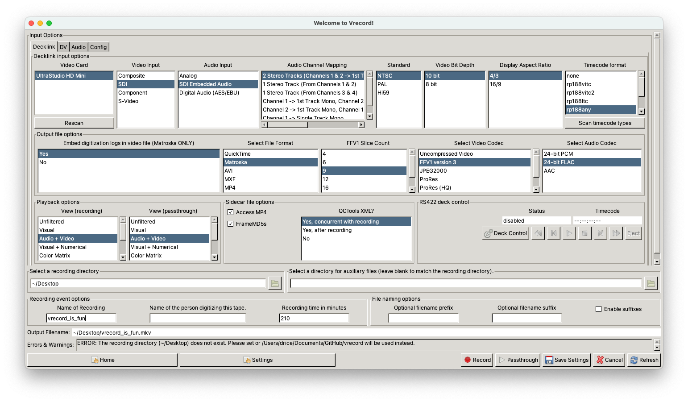
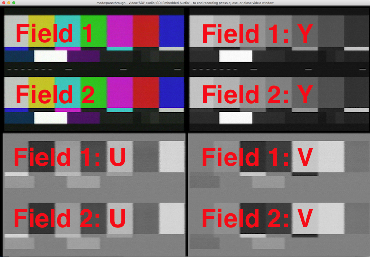

### Edit Mode

Running vrecord in edit mode opens a GUI window that allows you to change your recording options and then start digitizing a tape. 

Run edit mode by typing:
```
vrecord -e
```


After selecting all of your options and clicking "OK," you will be prompted to enter a unique ID for the file. After the ID is entered, the incoming video signal will be recorded to a file with some associated metadata files. When you are finished recording, you can close the vrecord window. If you've set a time limit for capture, the vrecord window will automatically close when the time limit has been reached.

By default, vrecord will create a video file, a framemd5 file (which creates an MD5 hash value [AKA a checksum] for every frame of video), an ffmpeg log, and a capture options log (which records the options that you selected in the GUI like codec and video bit depth). Vrecord will check all FFV1 and uncompressed video files in QuickTime or Matroska wrappers against local [MediaConch](https://mediaarea.net/MediaConch/about.html) policies, and will alert the user if the file does not conform to vrecord and archival standards. Vrecord can also create a [QCTools](https://github.com/bavc/qctools) XML file, which measures characteristics of the video signal, and a PNG file, which provides an easy-to-assess, overarching view of the video signal across time. The QCTools XML can be imported into QCTools for further analysis. 

#### Options for Video Capture

All of the options in the vrecord GUI (which appears when running `vrecord -e`), or otherwise in terminal prompts, are explained below. If you want to feel like a college freshman, you can choose "Undeclared" for any of the options below. You will be prompted later to make a choice before the software actually begins recording:

**Select a recording directory** — Choose the location (on an internal or external hard drive) where you want your resulting video files and logs to be saved.

**Select video input** — Choose how the video signal will be entering the capture device. You can receive the video signal through Composite, SDI, Component, or S-Video cables.

**Select audio input** — Choose how the audio signal will be entering the capture device. You can receive the audio signal through Analog (such as XLR), SDI, or other digital audio cables.  

**Select file format** — Choose the file format that you want the video to be saved in. This is also often called the container.

**Select codec for video** — Choose how you would like the video signal to be encoded digitally. You can choose from some uncompressed, lossless, and lossy codecs.

**Select bit depth for video** — Choose the level of bit depth you would like for your video file. Vrecord supports 10 and 8-bit video capture.

**Select FFV1 slice count** - If you select FFV1 as your video codec, you will be prompted to choose between a number of "slice count" options. An error detection/correction mechanism specific to FFV1, slices allow for each frame of video to be split into sub-sections, which will, in turn, each receive their own CRC checksum value. Keep in mind that the higher the slice count, the larger the resulting file.

**Select codec for audio** - Choose how you would like the audio signal to be encoded digitally. You can choose between uncompressed or lossless codecs.

**Select audio channel mapping** — Choose how you want the audio to be captured. Currently vrecord captures audio at 24-bits and can only capture 4 tracks. The options are: 
* "2 Stereo Tracks" — For capturing videotape formats that have four tracks which are arranged as stereo pairs.
* "1 Stereo Track (From Channels 1 & 2)" — For capturing videotape formats that have two channels of audio which were recorded as a stereo pair.
* "1 Stereo Track (From Channels 3 & 4)" — Same as above, but creates stereo track from second pair of inputs.
* "Channel 1 -> 1st Track Mono, Channel 2 -> 2nd Track Mono" — For capturing videotapes with audio recorded on Channel 1 only. Vrecord will capture the audio from Channel 1 and create a mono track. 
* "Channel 2 -> 1st Mono, Channel 1 -> 2nd Track Mono" — For capturing videotapes with with audio recorded on Channel 2 only. Vrecord will take the audio from Channel 2 and place it in a Channel 1 mono track. 

**Select timecode format** - vrecord now offers limited timecode support by (1) storing a correct first timecode value within your file, and (2) creating a sidecar .txt that will contain the timecode values, continuous or not, for all video frames. If you are uncertain about the type of historical timecode recorded on your tape, the "Scan timecode formats" button located below this drop-down menu will test your tape and provide useful information. The options for timecode include:
* rp188vitc
* rp188vitc2
* rp188ltc
* rp188any
* vitc
* vitc2
* serial

**Select standard** — Select the television standard of the tape you are digitizing. Currently vrecord only supports NTSC and PAL.

**Select view (for recording)** — Select the display you want to see as you digitize your tape. See [Video Views](#video-views) below for more details.

**Select view (for passthrough)** — Select the display you want to see as you preview your tape before capture. See [Video Views](#video-views) below for more details.

**Create QCTools XML?** — vrecord can create an XML file that contains a measurement of the characteristics of the video signal (such as luminance, color saturation, audio levels, etc.). vrecord can create this file either during capture, or as a post process. The XML will then be compressed using [gzip](https://www.gnu.org/software/gzip/).
* Choosing to create a QCTools XML is highly recommended. These files can be easily imported into QCTools for further analysis and, if you choose this option, vrecord will also (1) analyze the video for potential errors (reporting in your terminal window, post-capture, about the signal's adherence to broadcast range specifications), and (2) use this QCTools data to generate a easy-to-review [image file](https://github.com/amiaopensource/vrecord/blob/master/Resources/Documentation/analog_digitization.md#qc-graphs).

**Frame MD5s** — You can choose to create an MD5 hash value (AKA a checksum) for each frame of video captured. Frame MD5s are strongly recommended, as some dropped-frame errors will not be caught without the hash values. A separate .md5 file with all the hash values will be created along with the video file. Generally choosing to create frame-level MD5s will not slow down or hinder the capture of your video. To read more about the value of frame-level MD5s see this article: http://dericed.com/papers/reconsidering-the-checksum-for-audiovisual-preservation/ 

**Embedding logs** — If you select the Matroska file format, vrecord can embed the logs it generates into the Matroska container. Preservation metadata will then be available to the user both as sidecar logs (the vrecord default) and within the file itself. After logs have been attached, you can extract and read them as follows:
* To show a list of attachments to a video file and their IDs, type: `mkvmerge -i [video filename]`
* To extract attachments with IDs 1 through 4, type: `mkvextract [video filename] attachments 1 2 3 4`
* The logs will then be extracted into the directory you're in, where they can be opened with a text editor.

**Set recording time** — Set the amount of time (in minutes) that you would like vrecord to capture for, or leave it blank to capture indefinitely. For example, if you are digitizing a tape with a capacity of 30 minutes of video, you might want set vrecord to capture for 33 minutes. After 33 minutes vrecord will automatically stop recording and shut down. You may select a preset length from the dropdown menu, or type a different number. If you enter a number, it should be an integer or decimal in minutes (e.g. `15` will record for 15 minutes, and `15.75` will record for 15 minutes and 45 seconds).

**Enter the name of the person digitizing this tape** — This field is optional. You can enter the name of the technician digitizing the tape. The name will be written to the capture options log produced at the end of the transfer.

**Invert Second Channel of Audio** — This option allows you to invert the phase of the second channel of audio on ingest. This option is only for rare cases. Use only if you are positive that the audio channels are 180 degrees out of phase!

Click "OK" when you are finished with your selections. Vrecord will save all of your selections to a configuration file. If any selections are "Undeclared" vrecord will prompt you in the terminal window to make a choice. 

Vrecord will then prompt you for a unique ID. The ID that you type in will become a prefix for the filename of all the resulting files in that recording session. After entering your unique ID you will be asked to press enter to start recording. Press enter and start playing your tape. The vrecord window will appear. Do not type any keys or click the mouse inside the window while the vrecord is working. 

#### Video Views

**Unfiltered mode** — Unfiltered mode display only the playback image in the vrecord window. This option works well to aviod buffer overruns, PTS discontinuties, and crashing for setups that cannot handle the additional processing during capture.

**Broadcast Range Visual mode** — Broadcast Range Visual mode displays the video feed, the video feed with pixels out of broadcast range highlighted, the waveform monitor, and the vectorscope in the vrecord window.

**Full Range Visual mode** — Full Range Visual mode displays the video feed, the video feed with pixels at full range extremes highlighted, the waveform monitor, and the vectorscope in the vrecord window.

**Visual + Numerical mode** — Visual and Numerical mode displays your favorite video feeds and scopes as well as numerical values for the characteristics of the video signal in the left sidebar. 


* The numerical values are as follows:

    * Y — Low, high, and average luminance of the video signal. "Diff" means the difference of the luminance between successive frames.
    * U — Low, high, and average of the U channel value of the video signal. "Diff" means the difference of the U value between successive frames.
    * V — Low, high, and average of the V channel value of the video signal. "Diff" means the difference of the V value between successive frames.
    * SAT — Low, high, and average saturation values (sometimes called chroma) of the video signal.
    * HUE — Low, high, and average hue values of the video signal.
    * TOUT — The percentage of pixels that are temporal outliers. Temporal Outliers are pixels which have different values from the pixels above or below them. This is useful for detecting noise in the video signal or other artifacts. However, the number will also increase with fast motion, camera movement, or cuts to different shots.  
    * VREP — The amount of vertical line repetitions in the video. The VREP reading can be useful for detecting video artifacts, dropout, and especially head clogs.
    * BRNG — Percentage of pixels that are in broadcast range. This may be helpful for detecting problems with the video signal such as dropout or if the signal has not been calibrated properly. If BRNG is 0.1 or greater, you probably have an issue.

**Color Matrix mode** — Color Matrix mode displays the video feed as seen through a matrix with hue and saturation differences to aid in calibrating hue and chroma. If the preferred image is not seen in the center square of the matrix, hue and chroma levels may need to be adjusted.


**Bit Planes mode** — Bit Planes mode allows to display the video according to the bit position of each plane.

**Quality Control View mode** — Quality Control View mode can display all the views above, as well as several other quality control tools (waveforms, vectorscopes, and histograms). The menu in QC View shows options tied to keystrokes; pressing the key listed next to the name of the view you want will display that view. This feature means you can switch between several different views during the same transfer. QC View key bindings are as follows:

* Views
  * 1 — Broadcast Range Visual
  * 2 — Full Range Visual
  * 3 — Visual + Numerical
  * 4 — Color Matrix
  * 5 — Bit Planes
  * 6 — Split Fields: Splits a video frame into its two fields (odd lines appear in the top half of the image, even lines in the bottom half). QC View shows these fields in four pairs. Clockwise from top left: entire image, Y-values only, V-values only, U-values only.

  

* Other tools to monitor video transfer
  * 7 — Color waveform: Full-screen waveform rendered in the actual color values of the signal.
  * 8 — Overlaid waveform: The above, but overlaid on the video signal.
  * 9 — Color vectorscope: Full-screen vectorscope rendered in the actual color values of the signal.
  * 0 — Overlaid vectorscope: The above, but overlaid on the video signal.
  * o — Oscilloscope: Displays luma and two chroma values for one line in the frame (line is indicated by white dots).
  * h — Histogram: Displays frequency with which values in each channel occur, with one graph per channel (YUV or RGB, depending on input).
  * H — Overlaid histogram: The above, but laid end-to-end and overlaid on the video signal.
* Toggling the display
  * d — Toggle display filter: Switches between Y-only and YUV waveform displays (in views 1-3).
  * w — Toggle waveform filter: Switches between different waveform filters (in views 1-3): "lowpass," "flat," "aflat," "chroma," "color," "acolor." For more information, see [FFmpeg waveform filter documentation](https://ffmpeg.org/ffmpeg-filters.html#waveform).
  * g — Toggle graticule: Switch graticule (the lines and targets on waveforms and vectorscopes) on and off. (Applies in views 1-3 and 7-0.)
  * p — Toggle peak envelope: Switch between options to display the minimum and maximum values recorded by the waveform and vectorscope (in views 1-3). "None" means you won't see the peak values; "instant" means peak values will be highlighted as they occur; "peak" holds peak values across the full transfer for reference; and "peak+instant" combines the two.
  * i — Increase image intensity.
  * I — Decrease image intensity.
  * = — Refresh onscreen display. Useful if menu options disappear.
  * f — Make window fullscreen. (Press 'f' again to exit.)
  * ctrl + s — Turn off the above key assignments to use default mpv key bindings.
  
#### Clearing the Configuration File

  By default vrecord saves the choices you made the last time you used the program in a configuration file so that these options are selected the next time you use vrecord. If you would like to clear this configuration file and create a new one type:

  ```
  vrecord -x
  ```
  Vrecord will then prompt you to make selections for video capture and proceed to start recording a new tape. If you want to interrupt vrecord hold down `ctrl + c`.
